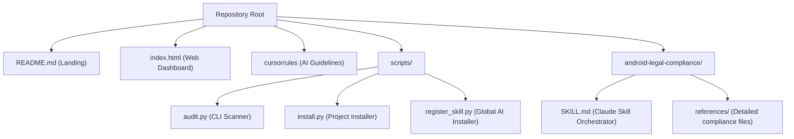

# Android Legal and Compliance Guard

[](https://opensource.org/licenses/MIT)
[](https://developer.android.com)
[](#cursor-rules)
[](#global-jurisdictions-covered)
[](#global-jurisdictions-covered)

The developer compliance shield for solo and indie Android developers. This toolkit helps you ship applications that avoid regulatory rejection, fines, or store bans globally.

This repository compiles public regulator guidelines, platform developer policies, and security baselines into actionable engineering guardrails, an interactive browser-based dashboard, and an automated CLI audit script updated for the 2026/2027 compliance landscape.

---

## Key Features

Android developers face strict, extraterritorial laws. Fines can reach significant amounts (such as 20 million EUR or 4 percent of global turnover under GDPR, and 250 crore INR under India DPDP), and platform policies are enforced automatically.

This repository resolves compliance at the codebase level, providing:
*   **Interactive Web Dashboard (index.html)** - A responsive, browser-based checklist that saves your progress, exports Markdown status reports, and dynamically generates custom Privacy Policies based on your app configuration.
*   **CLI Scanner (scripts/audit.py)** - Scan your Android project files locally (supporting multi-module architectures) for compliance and security warnings, generating a local checklist report (`COMPLIANCE_REPORT.md`).
*   **AI Guardrails (.cursorrules)** - Instruct Cursor, Windsurf, or Copilot agents to generate compliant code.
*   **Global Registration (scripts/register_skill.py)** - A 1-click script to install these rules globally for your local AI coding agents.

---

## Directory Structure



---

## 💻 1. Interactive Web Dashboard (index.html)

Open `index.html` in your browser. This offline dashboard offers:
*   **Application Configuration Filters:** Select active jurisdictions (GDPR, India DPDP, CCPA) and app features (Ads, Accounts, Children Target) to dynamically display only relevant requirements.
*   **Progress Persistence:** Automatically saves your checkbox entries using localStorage.
*   **Checklist Exporter:** Generate and download a formatted `COMPLIANCE_REPORT.md` checklist representing your current progress.
*   **Dynamic Privacy Policy Generator:** Generates a custom, compliant Privacy Policy tailored to your app metadata and selected configurations.

---

## 💻 2. CLI Scanner (scripts/audit.py)

A standalone compliance auditor that parses your project code recursively (supporting multi-module projects) and outputs findings directly to standard out and a local `COMPLIANCE_REPORT.md` file.

### How to Run
```bash
python scripts/audit.py /path/to/your/android/project
```

---

## 🤖 3. Global AI Registration (scripts/register_skill.py)

Install this compliance shield globally on your machine so that AI coding agents automatically consult it for any workspace you open.

### How to Run
```bash
python scripts/register_skill.py
```

---

## 🤖 4. Cursor/Windsurf Rules (.cursorrules)

Enforce compliance and accessibility by default during AI generation. Drop the .cursorrules file into the root of your project:
*   **Automates** permission audits before they are added to AndroidManifest.xml.
*   **Enforces** safe database transactions using encrypted shared preferences.
*   **Ensures** TalkBack/VoiceOver compatibility in Compose and XML UIs.
*   **Flags** insecure code paths before they are built.
*   **Supports Slash Commands:** Type `/privacypolicy` or `/terms` in the editor chat for dynamic code generation.

---

## Global Jurisdictions Covered

*   **European Union and UK:** GDPR / ePrivacy Directive. Mandates strict consent, cookie banners, and user deletion rights.
*   **India:** IT Act + Digital Personal Data Protection (DPDP) Act, 2023 and Rules, 2025. Extraterritorial scope. Mandates consent forms, a designated Grievance Officer, and 1-year log retention.
*   **United States:** CCPA/CPRA + patchwork of over 20 state privacy laws (TX, VA, CO, UT, CT, etc.). Mandates "Do Not Sell My Info" and Universal Opt-Out signals.
*   **Brazil:** LGPD. South American equivalent to GDPR.
*   **Canada:** PIPEDA + Quebec Law 25.
*   **Accessibility:** European Accessibility Act (EAA) (enforceable since June 28, 2025). Mandates WCAG 2.1 Level AA compliance for consumer-facing apps in the EU market.

---

## Disclaimer

This project is engineering-focused compliance reference material, not legal advice. Laws, developer terms, and enforcement thresholds evolve constantly. Always cross-reference facts with official government or platform resources. For high-risk applications (e.g. handling biometric data, healthcare, or financial payments), consult a qualified legal professional.

---

## License

This project is licensed under the MIT License - see the [LICENSE](android-legal-compliance/LICENSE) file for details.
