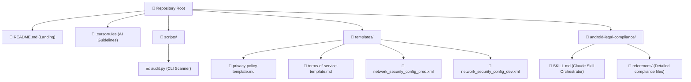

# 🛡️ Android Legal & Compliance Guard 🛡️

[](https://opensource.org/licenses/MIT)
[](https://developer.android.com)
[](#-cursor-rules)
[](#-global-jurisdictions-covered)
[](#-global-jurisdictions-covered)

The **ultimate developer compliance shield** for solo and indie Android developers. Ship apps that won't get rejected, fined, or banned—globally, not just in one country. 

This repository compiles public regulator guidelines, platform developer policies, and security baselines into **actionable engineering guardrails**, an **interactive CLI audit script**, and **ready-to-use compliance templates** updated for **2026/2027**.

---

## 🚀 Why Use This?

Android developers face strict, extraterritorial laws. Fines can reach **€20 million or 4% of global turnover (GDPR)** and **₹250 crore (India DPDP)**, and Google Play automatically flags or deletes non-compliant apps. 

This repo solves compliance at the code level, providing:
*   💻 **Interactive CLI Scanner** — Scan your Android project files instantly for compliance & security warnings.
*   🤖 **AI Guardrails (`.cursorrules`)** — Instruct Cursor, Windsurf, or Copilot agents to code legally and securely.
*   📄 **Legal Document Templates** — Modular, pre-drafted Privacy Policies & Terms of Service.
*   🧠 **Claude / MCP Skill (`SKILL.md`)** — A fully-packaged skill for Claude Desktop.
*   🌍 **2026/2027 Global Updates** — Covering India DPDP Rules, European Accessibility Act (EAA), and the latest Play Store identity verification deadlines.

---

## 📦 Directory Structure



---

## 💻 1. Interactive CLI Scanner (`scripts/audit.py`)

A standalone compliance auditor that parses your project code without sharing it with external servers.

### How to Run:
```bash
python scripts/audit.py /path/to/your/android/project
```

### What It Audits:
*   **Target SDK Level:** Flags if targeting below **API 34/35/36** (Play Store 2026/2027 standard).
*   **Cleartext Traffic:** Checks for insecure HTTP settings (`android:usesCleartextTraffic="true"`).
*   **Network Security:** Validates if `networkSecurityConfig` is declared and if secure configs are in place.
*   **Dangerous Permissions:** Warns about `READ_CONTACTS` (which must use Android Contact Picker), precise location tracking without geofencing compliance, SMS, Call Logs, and unencrypted file access.
*   **Account Deletion:** Warns if account systems are active but no in-app or web deletion routes are detected.
*   **Children's Policies & Ads:** Flags Firebase/AdMob dependencies and warns of mandatory UMP SDK and COPPA configurations.

---

## 🤖 2. Cursor/Windsurf Rules (`.cursorrules`)

Force your AI coding agents to write compliant, secure, and accessible code by default. Drop the `.cursorrules` file into the root of your project:
*   **Automates** permission checks before adding them to `AndroidManifest.xml`.
*   **Enforces** safe database transactions using encrypted shared preferences.
*   **Ensures** TalkBack/VoiceOver compatibility in modern Jetpack Compose / XML UIs.
*   **Flags** insecure code paths before they are built.

---

## 📄 3. Compliance Templates (`templates/`)

Pre-drafted, developer-focused templates ready to fill out:
*   [privacy-policy-template.md](templates/privacy-policy-template.md) - GDPR, DPDP (with the 2025 Rules 1-year log retention standard), CCPA/CPRA, and COPPA compliant.
*   [terms-of-service-template.md](templates/terms-of-service-template.md) - Covers standard software EULAs, monetization, and disclaims medical/health advice for wellness apps.
*   [network_security_config_prod.xml](templates/network_security_config_prod.xml) - Blocks cleartext traffic completely for release builds.
*   [network_security_config_dev.xml](templates/network_security_config_dev.xml) - Blocks cleartext traffic except for localhost/emulator servers.

---

## 🧠 4. Packaged Claude Skill (`android-legal-compliance/`)

For AI assistants using the Claude desktop app or similar platforms, you can load the `android-legal-compliance/` folder as a local skill. It uses a core orchestrator `SKILL.md` and detailed reference modules:

*   [SKILL.md](android-legal-compliance/SKILL.md) — The data inventory checklist & global decision tree.
*   [global-privacy-laws.md](android-legal-compliance/references/global-privacy-laws.md) — GDPR, India DPDP, California CCPA/CPRA, LGPD, PIPEDA.
*   [play-store-policy.md](android-legal-compliance/references/play-store-policy.md) — Play Store Developer Verification, Contacts Picker Policy, Geofencing.
*   [app-store-policy.md](android-legal-compliance/references/app-store-policy.md) — Apple Privacy Nutrition Label & ATT rules.
*   [ad-monetization.md](android-legal-compliance/references/ad-monetization.md) — Google UMP SDK, consent parameters, COPPA tags.
*   [children-accessibility.md](android-legal-compliance/references/children-accessibility.md) — Families Policy, Age Signals API, European Accessibility Act (EAA).
*   [security-baseline.md](android-legal-compliance/references/security-baseline.md) — Secure storage, redacted logging, network config.
*   [legal-documents.md](android-legal-compliance/references/legal-documents.md) — Privacy policy and ToS clause reference.
*   [prelaunch-audit-checklist.md](android-legal-compliance/references/prelaunch-audit-checklist.md) — Submission audit checklist.

---

## 🌍 Global Jurisdictions Covered

*   🇪🇺 **European Union & UK:** GDPR / ePrivacy Directive. Mandates strict consent, cookie banners, and user deletion rights.
*   🇮🇳 **India:** IT Act + Digital Personal Data Protection (DPDP) Act, 2023 & Rules, 2025. Extraterritorial scope. Mandates consent forms, a designated Grievance Officer, and 1-year log retention.
*   🇺🇸 **United States:** CCPA/CPRA + patchwork of ~20 state privacy laws (TX, VA, CO, UT, CT, etc.). Mandates "Do Not Sell My Info" and Universal Opt-Out signals.
*   🇧🇷 **Brazil:** LGPD. Strictest South American equivalent to GDPR.
*   🇨🇦 **Canada:** PIPEDA + Quebec Law 25.
*   🇪🇺 **Accessibility:** European Accessibility Act (EAA) (enforceable since June 28, 2025). Mandates WCAG 2.1 Level AA compliance for consumer-facing apps in the EU market.

---

## ⚖️ Disclaimer

*This project is engineering-focused compliance reference material, **not legal advice**. Laws, developer terms, and enforcement thresholds evolve constantly. Always cross-reference facts with official government/platform resources. For high-risk applications (e.g. handling biometric data, healthcare, or financial payments), consult a qualified legal professional.*

---

## 📄 License

This project is licensed under the MIT License - see the [LICENSE](android-legal-compliance/LICENSE) file for details.
